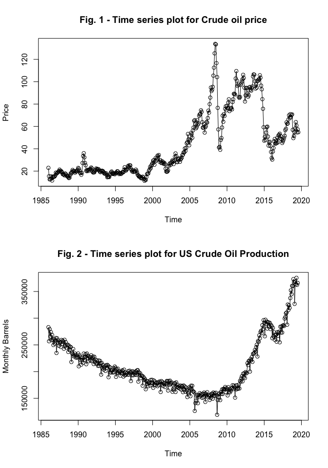

Crude Oil Analysis
================
Kevin Bonds
10/29/2019

The following is an analysis of crude oil data. There are many factors that come into play to influence the prices of petroleum products. An exhaustive study would take some time, but we can gain some insights and prepare for deeper analysis quite quickly. All code for this analysis can be found at: <https://github.com/kwbonds/crudeoil_products>. Feel free to clone/fork.

The first thing to do is to load the libraries needed

``` r
library(tidyverse)
library(readxl)
library(lubridate)
library(zoo)
library(knitr)
```

Load the data
-------------

The xls file can be downloaded from: <https://www.eia.gov/dnav/pet/PET_PRI_SPT_S1_M.htm>. The series history can be loaded by selecting the excel icon. Let's quickly create a csv called *spot\_crude.csv* of just the first data tab. We will load all tabs, from the xls directly, in a later step. Now let's load the csv into R to start formatting.

``` r
# Quickly read in WTI crude oil from csv
wti_crude_spot <- read_csv("../DATA/spot_crude.csv")
wti_crude_spot <- wti_crude_spot %>% 
        select(1:3) 
head(wti_crude_spot)
```

    ## # A tibble: 6 x 3
    ##   Date    `Cushing, OK WTI Spot Price FOB … `Europe Brent Spot Price FOB (…
    ##   <chr>                               <dbl>                           <dbl>
    ## 1 Jan-19…                              22.9                              NA
    ## 2 Feb-19…                              15.5                              NA
    ## 3 Mar-19…                              12.6                              NA
    ## 4 Apr-19…                              12.8                              NA
    ## 5 May-19…                              15.4                              NA
    ## 6 Jun-19…                              13.4                              NA

Formatting and adding MoM and YoY
---------------------------------

The Tidyverse has some great functions. One of them is the *lag()* function. It allows you to lag or offset some number of records that you specify. I used the default 1 for MoM and 12 for YoY (as seen below). The data is already sorted.

I also pulled out *Month* and *Year* to make it a little simpler to join on later.

``` r
# Create a clean df with MoM and YoY for just Crude Oil
wti_crude_spot <- wti_crude_spot %>% 
        mutate("Date2" = as.Date(as.yearmon(Date, "%b-%Y"), frac = 1),
               "Month" = month(Date2),
               "Year" = year(Date2),
               "MoM_crude_oil" = 
                       (`Cushing, OK WTI Spot Price FOB (Dollars per Barrel)` - 
                                lag(`Cushing, OK WTI Spot Price FOB (Dollars per Barrel)`))/ 
                       lag(`Cushing, OK WTI Spot Price FOB (Dollars per Barrel)`),
               "YoY_crude_oil" = 
                       (`Cushing, OK WTI Spot Price FOB (Dollars per Barrel)` - 
                                lag(`Cushing, OK WTI Spot Price FOB (Dollars per Barrel)`, 12))/ 
                       lag(`Cushing, OK WTI Spot Price FOB (Dollars per Barrel)`, 12))

kable(wti_crude_spot[12:17,], caption= "Table with MoM and YoY")
```

| Date     |  Cushing, OK WTI Spot Price FOB (Dollars per Barrel)|  Europe Brent Spot Price FOB (Dollars per Barrel)| Date2      |  Month|  Year|  MoM\_crude\_oil|  YoY\_crude\_oil|
|:---------|----------------------------------------------------:|-------------------------------------------------:|:-----------|------:|-----:|----------------:|----------------:|
| Dec-1986 |                                                16.11|                                                NA| 1986-12-31 |     12|  1986|        0.0584757|               NA|
| Jan-1987 |                                                18.65|                                                NA| 1987-01-31 |      1|  1987|        0.1576660|       -0.1866550|
| Feb-1987 |                                                17.75|                                                NA| 1987-02-28 |      2|  1987|       -0.0482574|        0.1481242|
| Mar-1987 |                                                18.30|                                                NA| 1987-03-31 |      3|  1987|        0.0309859|        0.4512292|
| Apr-1987 |                                                18.68|                                                NA| 1987-04-30 |      4|  1987|        0.0207650|        0.4548287|
| May-1987 |                                                19.44|                                             18.58| 1987-05-31 |      5|  1987|        0.0406852|        0.2639792|

Calculate some yearly stats
---------------------------

We can also quickly calculate some yearly stats and join them back to the original table. This may come in handy as features for a model. It's quick and easy so let's go ahead and do that now.

``` r
# Calculate yearly stats
year_stats <- wti_crude_spot %>% 
        group_by(Year) %>% 
        summarize( "yr_mean_crude" = mean(`Cushing, OK WTI Spot Price FOB (Dollars per Barrel)`),
                   "yr_median_crude" = median(`Cushing, OK WTI Spot Price FOB (Dollars per Barrel)`))
# Join to larger dataframe
wti_crude_spot <- left_join(wti_crude_spot, year_stats, on = c("Year" = "Year"))
kable(wti_crude_spot[12:17,], caption= "Table with Yearly Stats")
```

| Date     |  Cushing, OK WTI Spot Price FOB (Dollars per Barrel)|  Europe Brent Spot Price FOB (Dollars per Barrel)| Date2      |  Month|  Year|  MoM\_crude\_oil|  YoY\_crude\_oil|  yr\_mean\_crude|  yr\_median\_crude|
|:---------|----------------------------------------------------:|-------------------------------------------------:|:-----------|------:|-----:|----------------:|----------------:|----------------:|------------------:|
| Dec-1986 |                                                16.11|                                                NA| 1986-12-31 |     12|  1986|        0.0584757|               NA|         15.03667|             15.000|
| Jan-1987 |                                                18.65|                                                NA| 1987-01-31 |      1|  1987|        0.1576660|       -0.1866550|         19.17167|             19.145|
| Feb-1987 |                                                17.75|                                                NA| 1987-02-28 |      2|  1987|       -0.0482574|        0.1481242|         19.17167|             19.145|
| Mar-1987 |                                                18.30|                                                NA| 1987-03-31 |      3|  1987|        0.0309859|        0.4512292|         19.17167|             19.145|
| Apr-1987 |                                                18.68|                                                NA| 1987-04-30 |      4|  1987|        0.0207650|        0.4548287|         19.17167|             19.145|
| May-1987 |                                                19.44|                                             18.58| 1987-05-31 |      5|  1987|        0.0406852|        0.2639792|         19.17167|             19.145|

Loading the rest of the data from the xlsx
------------------------------------------

I want to read each tab, of the xlsx file, into it's own data frame to allow specifying column types--since the tabs differ in format a bit. They all have a few rows that need to be skipped, so let's do that as we read them in.

``` r
# Read rest of data directly from xlsx file into tables
raw_data_path <- "../DATA/raw_data_sheet.xlsx"
sheets <- raw_data_path %>%
        excel_sheets() %>% 
        set_names()

conv_gasoline <- read_excel(raw_data_path, sheet = sheets[3], skip = 2, col_types = c("date", "numeric", "numeric")) %>% 
        mutate("Month" = month(Date), "Year" = year(Date))

RBOB_gasoline <- read_excel(raw_data_path, sheet = sheets[4], skip = 2, col_types = c("date", "numeric")) %>% 
        mutate("Month" = month(Date), "Year" = year(Date))

heating_oil <- read_excel(raw_data_path, sheet = sheets[5], skip = 2, col_types = c("date", "numeric")) %>% 
        mutate("Month" = month(Date), "Year" = year(Date))

uls_diesel <- read_excel(raw_data_path, sheet = sheets[6], skip = 2, col_types = c("date", "numeric", "numeric", "numeric")) %>% 
        mutate("Month" = month(Date), "Year" = year(Date))

jet <- read_excel(raw_data_path, sheet = sheets[7], skip = 2, col_types = c("date", "numeric")) %>% 
        mutate("Month" = month(Date), "Year" = year(Date))
propane <- read_excel(raw_data_path, sheet = sheets[8], skip = 2, col_types = c("date", "numeric")) %>% 
        mutate("Month" = month(Date), "Year" = year(Date))
```

Join Together
-------------

Now that we have data frames for the various gasolines and heating oil, propane, etc. let's join them all into a new data frame. And also, clean and organize the resulting table a bit.

``` r
# Join conv_gasoline and heating_oil
energy_df <- left_join(wti_crude_spot, conv_gasoline[,2:5], on = c("Year" = "Year", "Month" = "Month")) %>% 
        left_join(heating_oil[,2:4], on = c("Year" = "Year", "Month" = "Month")) %>%
        left_join(uls_diesel[-1], on = c("Year" = "Year", "Month" = "Month")) %>% 
        left_join(RBOB_gasoline[-1], on = c("Year" = "Year", "Month" = "Month")) %>% 
        left_join(jet[-1], on = c("Year" = "Year", "Month" = "Month")) %>% 
        left_join(propane[-1], on = c("Year" = "Year", "Month" = "Month"))

energy_df <- energy_df %>% select("Date"= `Date2`, c(5:6, 2:3, 7:length(energy_df)))
head(energy_df)
```

    ## # A tibble: 6 x 18
    ##   Date       Month  Year `Cushing, OK WT… `Europe Brent S… MoM_crude_oil
    ##   <date>     <dbl> <dbl>            <dbl>            <dbl>         <dbl>
    ## 1 1986-01-31     1  1986             22.9               NA       NA     
    ## 2 1986-02-28     2  1986             15.5               NA       -0.326 
    ## 3 1986-03-31     3  1986             12.6               NA       -0.184 
    ## 4 1986-04-30     4  1986             12.8               NA        0.0182
    ## 5 1986-05-31     5  1986             15.4               NA        0.198 
    ## 6 1986-06-30     6  1986             13.4               NA       -0.127 
    ## # … with 12 more variables: YoY_crude_oil <dbl>, yr_mean_crude <dbl>,
    ## #   yr_median_crude <dbl>, `New York Harbor Conventional Gasoline Regular
    ## #   Spot Price FOB (Dollars per Gallon)` <dbl>, `U.S. Gulf Coast
    ## #   Conventional Gasoline Regular Spot Price FOB (Dollars per
    ## #   Gallon)` <dbl>, `New York Harbor No. 2 Heating Oil Spot Price FOB
    ## #   (Dollars per Gallon)` <dbl>, `New York Harbor Ultra-Low Sulfur No 2
    ## #   Diesel Spot Price (Dollars per Gallon)` <dbl>, `U.S. Gulf Coast
    ## #   Ultra-Low Sulfur No 2 Diesel Spot Price (Dollars per Gallon)` <dbl>,
    ## #   `Los Angeles, CA Ultra-Low Sulfur CARB Diesel Spot Price (Dollars per
    ## #   Gallon)` <dbl>, `Los Angeles Reformulated RBOB Regular Gasoline Spot
    ## #   Price (Dollars per Gallon)` <dbl>, `U.S. Gulf Coast Kerosene-Type Jet
    ## #   Fuel Spot Price FOB (Dollars per Gallon)` <dbl>, `Mont Belvieu, TX
    ## #   Propane Spot Price FOB (Dollars per Gallon)` <dbl>

Now we have a nice single data frame, with 18 columns, pertaining to our summary statistics as well as some other petroleum prices.

All the Variables
-----------------

Now we have quite a bit of data loaded into a single nice data frame. But we don't have much along the lines of outside influences to explain the changes in crude oil prices. One thing I can think of, might be US oil production levels. Let's grab that data and join it in.

``` r
# Add US crude oil production form https://www.eia.gov/dnav/pet/hist/LeafHandler.ashx?n=PET&s=MCRFPUS1&f=M
US_crude_prod <- read_excel("../DATA/US_crude_prod.xls", sheet = sheets[2], skip = 2, col_types = c("date", "numeric")) %>% 
        mutate("Month" = month(Date), "Year" = year(Date))

energy_df <- left_join(energy_df, US_crude_prod[-1], on = c("Year" = "Year", "Month" = "Month"))
```

Now we can start looking at the data
------------------------------------

Let's create some time series objects and plot them.

``` r
# Create time series objects for WTI Spot and Field Production
cop <-  ts(energy_df$`Cushing, OK WTI Spot Price FOB (Dollars per Barrel)`, start= c(1986,1), end = c(2019,8), frequency = 12)
prod_cude <-  ts(energy_df$`U.S. Field Production of Crude Oil (Thousand Barrels)`, start= c(1986,1), end = c(2019,8), frequency = 12)
par(mfrow=c(2,1))
# Plot them one on top of the other
plot(cop, type = "o", ylab = "Price", main = "Fig. 1 - Time series plot for Crude oil price")
plot(prod_cude, type = "o", ylab = "Monthly Barrels", main = "Fig. 2 - Time series plot for US Crude Oil Production")
```



Obviously we have some inflation impact to consider but, we can see quite a bit of volatility even considering monthly averages. Just looking at these plots doesn't suggest a nice correlation. But, since we haven't yet accounted for inflation, let's quickly look to see how correlated these data are over more recent data.

``` r
# Jan-2013 to July-2019
cor(energy_df$`Cushing, OK WTI Spot Price FOB (Dollars per Barrel)`[325:403], energy_df$`U.S. Field Production of Crude Oil (Thousand Barrels)`[325:403])
```

    ## [1] -0.4307947

``` r
# Feb-2015 to July-2019
cor(energy_df$`Cushing, OK WTI Spot Price FOB (Dollars per Barrel)`[350:403], energy_df$`U.S. Field Production of Crude Oil (Thousand Barrels)`[350:403])
```

    ## [1] 0.6026599

``` r
# Jan-2016 to July-2019
cor(energy_df$`Cushing, OK WTI Spot Price FOB (Dollars per Barrel)`[361:403], energy_df$`U.S. Field Production of Crude Oil (Thousand Barrels)`[361:403])
```

    ## [1] 0.6207468

It does seem that as we take more near-term data the correlation is a bit stronger. From above you can see that taking Jan/2016 - July/2019 and calculating the correlation coefficient we get 0.62 meaning a somewhat strong, positive correlation--as 1.0 would be data perfectly moving in relation to each other, and 0.8 being considered strong. Maybe if we adjusted for inflation things would look better here. We could use CPI and adjust the numbers we have or find some already adjusted perhaps.

But for now, we can check to see where the max price, min price, max MoM and min MoM (which would be the max decrease) to give us a sense of when these maximums and minimums occurred.

``` r
# Max crude oil price
energy_df[which.max(energy_df$`Cushing, OK WTI Spot Price FOB (Dollars per Barrel)`),][c(1,4)]
```

    ## # A tibble: 1 x 2
    ##   Date       `Cushing, OK WTI Spot Price FOB (Dollars per Barrel)`
    ##   <date>                                                     <dbl>
    ## 1 2008-06-30                                                  134.

``` r
# Min crude oil price
energy_df[which.min(energy_df$`Cushing, OK WTI Spot Price FOB (Dollars per Barrel)`),][c(1,4)]
```

    ## # A tibble: 1 x 2
    ##   Date       `Cushing, OK WTI Spot Price FOB (Dollars per Barrel)`
    ##   <date>                                                     <dbl>
    ## 1 1998-12-31                                                  11.4

``` r
# Max MoM
energy_df[which.max(energy_df$MoM_crude_oil),][c(1,6)]
```

    ## # A tibble: 1 x 2
    ##   Date       MoM_crude_oil
    ##   <date>             <dbl>
    ## 1 1990-08-31         0.480

``` r
# min MoM
energy_df[which.min(energy_df$MoM_crude_oil),][c(1,6)]
```

    ## # A tibble: 1 x 2
    ##   Date       MoM_crude_oil
    ##   <date>             <dbl>
    ## 1 1986-02-28        -0.326

``` r
# Max MoM
energy_df[which.max(energy_df$MoM_crude_oil),][c(1,6)]
```

    ## # A tibble: 1 x 2
    ##   Date       MoM_crude_oil
    ##   <date>             <dbl>
    ## 1 1990-08-31         0.480

Extra Credit
------------

One of our extra credit questions is how correlated is the US Gulf Coast Conventional Gasoline Spot price with the New York Harbor Conventional Gasoline Regular Spot Price. This is easily calculated using the *cor()* base function in R.

``` r
# How tightly correlated is Gulf Coast Spot prices vs New York Harbor?
cor(energy_df$`U.S. Gulf Coast Conventional Gasoline Regular Spot Price FOB (Dollars per Gallon)`[6:405], energy_df$`New York Harbor Conventional Gasoline Regular Spot Price FOB (Dollars per Gallon)`[6:405])
```

    ## [1] 0.9980321

I'm also curious about the crude oil price vs gasoline price? So let's calculate the correlation for Cushing, OK WTI Spot Price vs. US Gulf Coast Conventional Gasoline Regular Spot Price.

``` r
# How tightly correlated is Gulf Coast Spot prices vs Cushing, OK WTI?
cor(energy_df$`U.S. Gulf Coast Conventional Gasoline Regular Spot Price FOB (Dollars per Gallon)`[6:405], energy_df$`Cushing, OK WTI Spot Price FOB (Dollars per Barrel)`[6:405])
```

    ## [1] 0.9853421

Both of these are very tightly correlated as one might expect. At least at the monthly average level.

Timeboxed Summary
=================

So we have created a nice table and identified the need for more influential data. We brought in US oil production data, to help, and calculated the correlation coefficient to understand how tightly these move together. We determined that they are only somewhat correlated. Also, we found the dates at which 4 maximum or minimum events happened. Also, we saw from a simple plot that crude oil prices have experience very rapid changes. We calculated the Month-over-Month and Year-over-Year to help identify when this change was most rapid and possible help with modeling.

We also calculated the correlation coefficients between 2 gas prices and oil production and gas for extra credit.

Side Note: Git was used throughout this excercise. Commiting regularly as new analysis was added and tested to run.

Next steps
----------

Some next steps would be to adjust our prices for inflation; try fitting a linear model using the features we have; Do some investigating around seasonality (maybe use the Autocorrelation function); search for some other external causes/data.

Thanks for the opportunity
==========================

Thanks for the opportunity to showcase my skills. This has been a fun exercise. As with any coding exercise it helps to get practice. I would enjoy spending more time and continue with more in depth modeling. I may continue that given the time.
