Crude Oil Modeling
================
Kevin Bonds
26 November, 2019

In an attempt to showcase my current understanding of various modeling techniques, the following analysis will be carried out and explained. This is a learning process for me and also will be an iterative--meaning it may be incomplete to the viewer at any given moment. Nonetheless, it will be public in it's unfinished state in the hopes that others can instruct and/or benefit.

I'll attempt to show some basic data ingestion, data preparation, visualization, and predictive modeling techniques in the process. I will use the *R* programming language with R Markdown for this document.

All code for this analysis can be found at: <https://github.com/kwbonds/crudeoil_products>. Feel free to clone/fork and comment to me at <kevin.w.bonds@gmail.com>.

The first thing to do is to load the libraries needed. I like to keep these collected at the top of any analysis rather that scattered throughout for future reference.

``` r
library(tidyverse)
library(readxl)
library(lubridate)
library(zoo)
library(knitr)
library(ggplot2)
library(yardstick)
library(Metrics)
library(astsa)
```

Collecting data
===============

I'm going to start with some time series analysis using crude oil products. This data can be found as an xls file that can be downloaded from: <https://www.eia.gov/dnav/pet/PET_PRI_SPT_S1_M.htm>.

I'll load the data and do some quick formatting. Then I'll take a quick look and begin modeling the data and make predictions. Loading the individual Excel tabs in to tables and joining them into one big table and add Month-over\_Month and Year-over-Year for later maybe. We may do additional work to add features late.

``` r
# Read rest of data directly from xlsx file into tables
raw_data_path <- "DATA/raw_data_sheet.xlsx"
sheets <- raw_data_path %>%
        excel_sheets() %>% 
        set_names()

crude_oil <- read_excel(raw_data_path, sheet = sheets[2], skip = 2, col_types = c("date", "numeric", "numeric")) %>% 
        mutate("Date2" = as.Date(as.yearmon(Date, "%b-%Y"), frac = 1),
               "Month" = month(Date2),
               "Year" = year(Date2))
```

``` r
crude_oil <- crude_oil %>% 
        mutate("Date2" = as.Date(as.yearmon(Date, "%b-%Y"), frac = 1),
               "Month" = month(Date2),
               "Year" = year(Date2),
               "MoM_crude_oil" = 
                       (`Cushing, OK WTI Spot Price FOB (Dollars per Barrel)` - 
                                lag(`Cushing, OK WTI Spot Price FOB (Dollars per Barrel)`))/ 
                       lag(`Cushing, OK WTI Spot Price FOB (Dollars per Barrel)`),
               "YoY_crude_oil" = 
                       (`Cushing, OK WTI Spot Price FOB (Dollars per Barrel)` - 
                                lag(`Cushing, OK WTI Spot Price FOB (Dollars per Barrel)`, 12))/ 
                       lag(`Cushing, OK WTI Spot Price FOB (Dollars per Barrel)`, 12))
```

``` r
conv_gasoline <- read_excel(raw_data_path, sheet = sheets[3], skip = 2, col_types = c("date", "numeric", "numeric")) %>% 
        mutate("Month" = month(Date), "Year" = year(Date))

RBOB_gasoline <- read_excel(raw_data_path, sheet = sheets[4], skip = 2, col_types = c("date", "numeric")) %>% 
        mutate("Month" = month(Date), "Year" = year(Date))

heating_oil <- read_excel(raw_data_path, sheet = sheets[5], skip = 2, col_types = c("date", "numeric")) %>% 
        mutate("Month" = month(Date), "Year" = year(Date))

uls_diesel <- read_excel(raw_data_path, sheet = sheets[6], skip = 2, col_types = c("date", "numeric", "numeric", "numeric")) %>% 
        mutate("Month" = month(Date), "Year" = year(Date))

jet <- read_excel(raw_data_path, sheet = sheets[7], skip = 2, col_types = c("date", "numeric")) %>% 
        mutate("Month" = month(Date), "Year" = year(Date))
propane <- read_excel(raw_data_path, sheet = sheets[8], skip = 2, col_types = c("date", "numeric")) %>% 
        mutate("Month" = month(Date), "Year" = year(Date))

kable(crude_oil[12:17,], caption= "Table with MoM and YoY")
```

| Date       |  Cushing, OK WTI Spot Price FOB (Dollars per Barrel)|  Europe Brent Spot Price FOB (Dollars per Barrel)| Date2      |  Month|  Year|  MoM\_crude\_oil|  YoY\_crude\_oil|
|:-----------|----------------------------------------------------:|-------------------------------------------------:|:-----------|------:|-----:|----------------:|----------------:|
| 1986-12-15 |                                                16.11|                                                NA| 1986-12-31 |     12|  1986|        0.0584757|               NA|
| 1987-01-15 |                                                18.65|                                                NA| 1987-01-31 |      1|  1987|        0.1576660|       -0.1866550|
| 1987-02-15 |                                                17.75|                                                NA| 1987-02-28 |      2|  1987|       -0.0482574|        0.1481242|
| 1987-03-15 |                                                18.30|                                                NA| 1987-03-31 |      3|  1987|        0.0309859|        0.4512292|
| 1987-04-15 |                                                18.68|                                                NA| 1987-04-30 |      4|  1987|        0.0207650|        0.4548287|
| 1987-05-15 |                                                19.44|                                             18.58| 1987-05-31 |      5|  1987|        0.0406852|        0.2639792|

Since prices are taken at the end of the month, dates are converted to month end.

``` r
# Join conv_gasoline and heating_oil
energy_df <- 
        left_join(crude_oil, conv_gasoline[,2:5], on = c("Year" = "Year", "Month" = "Month")) %>% 
        left_join(heating_oil[,2:4], on = c("Year" = "Year", "Month" = "Month")) %>%
        left_join(uls_diesel[-1], on = c("Year" = "Year", "Month" = "Month")) %>% 
        left_join(RBOB_gasoline[-1], on = c("Year" = "Year", "Month" = "Month")) %>% 
        left_join(jet[-1], on = c("Year" = "Year", "Month" = "Month")) %>% 
        left_join(propane[-1], on = c("Year" = "Year", "Month" = "Month"))

energy_df <- energy_df %>% select("Date"= `Date2`, c(5:6, 2:3, 7:length(energy_df)))
kable(head(energy_df))
```

| Date       |  Month|  Year|  Cushing, OK WTI Spot Price FOB (Dollars per Barrel)|  Europe Brent Spot Price FOB (Dollars per Barrel)|  MoM\_crude\_oil|  YoY\_crude\_oil|  New York Harbor Conventional Gasoline Regular Spot Price FOB (Dollars per Gallon)|  U.S. Gulf Coast Conventional Gasoline Regular Spot Price FOB (Dollars per Gallon)|  New York Harbor No. 2 Heating Oil Spot Price FOB (Dollars per Gallon)|  New York Harbor Ultra-Low Sulfur No 2 Diesel Spot Price (Dollars per Gallon)|  U.S. Gulf Coast Ultra-Low Sulfur No 2 Diesel Spot Price (Dollars per Gallon)|  Los Angeles, CA Ultra-Low Sulfur CARB Diesel Spot Price (Dollars per Gallon)|  Los Angeles Reformulated RBOB Regular Gasoline Spot Price (Dollars per Gallon)|  U.S. Gulf Coast Kerosene-Type Jet Fuel Spot Price FOB (Dollars per Gallon)|  Mont Belvieu, TX Propane Spot Price FOB (Dollars per Gallon)|
|:-----------|------:|-----:|----------------------------------------------------:|-------------------------------------------------:|----------------:|----------------:|----------------------------------------------------------------------------------:|----------------------------------------------------------------------------------:|----------------------------------------------------------------------:|-----------------------------------------------------------------------------:|-----------------------------------------------------------------------------:|-----------------------------------------------------------------------------:|-------------------------------------------------------------------------------:|---------------------------------------------------------------------------:|-------------------------------------------------------------:|
| 1986-01-31 |      1|  1986|                                                22.93|                                                NA|               NA|               NA|                                                                                 NA|                                                                                 NA|                                                                     NA|                                                                            NA|                                                                            NA|                                                                            NA|                                                                              NA|                                                                          NA|                                                            NA|
| 1986-02-28 |      2|  1986|                                                15.46|                                                NA|       -0.3257741|               NA|                                                                                 NA|                                                                                 NA|                                                                     NA|                                                                            NA|                                                                            NA|                                                                            NA|                                                                              NA|                                                                          NA|                                                            NA|
| 1986-03-31 |      3|  1986|                                                12.61|                                                NA|       -0.1843467|               NA|                                                                                 NA|                                                                                 NA|                                                                     NA|                                                                            NA|                                                                            NA|                                                                            NA|                                                                              NA|                                                                          NA|                                                            NA|
| 1986-04-30 |      4|  1986|                                                12.84|                                                NA|        0.0182395|               NA|                                                                                 NA|                                                                                 NA|                                                                     NA|                                                                            NA|                                                                            NA|                                                                            NA|                                                                              NA|                                                                          NA|                                                            NA|
| 1986-05-31 |      5|  1986|                                                15.38|                                                NA|        0.1978193|               NA|                                                                                 NA|                                                                                 NA|                                                                     NA|                                                                            NA|                                                                            NA|                                                                            NA|                                                                              NA|                                                                          NA|                                                            NA|
| 1986-06-30 |      6|  1986|                                                13.43|                                                NA|       -0.1267880|               NA|                                                                               0.42|                                                                              0.409|                                                                   0.38|                                                                            NA|                                                                            NA|                                                                            NA|                                                                              NA|                                                                          NA|                                                            NA|

Modeling crude oil
==================

Let's go ahead and try some ARIMA modeling. To create a time series model for crude oil price we should determine what sort of model may best fit. Looking at the plot of the data:

``` r
ggplot(energy_df, aes(x = energy_df$Date, y = energy_df$`Cushing, OK WTI Spot Price FOB (Dollars per Barrel)`)) + geom_line() + ylab("WTI Spot Price (Dollars per Barrel)") + xlab("Date") + ggtitle("Monthly average for West Texas Crude Oil")
```

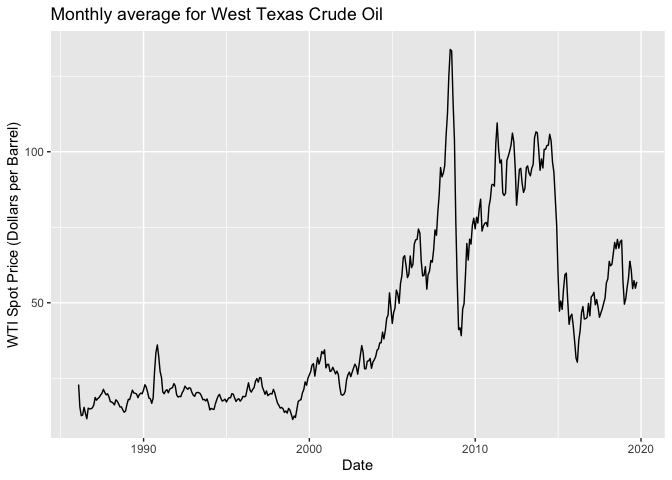

It appears the data is not stabilized. There is a general trend and possibly some exponential behavior. Let's try standardizing the data by log-differencing to remove trend and growth.

``` r
cop <-  ts(energy_df$`Cushing, OK WTI Spot Price FOB (Dollars per Barrel)`, start= c(1986,1), end = c(2019,8), frequency = 12)
```

``` r
crude_oil_returns <- log(cop)
plot(crude_oil_returns, type = "l")
```

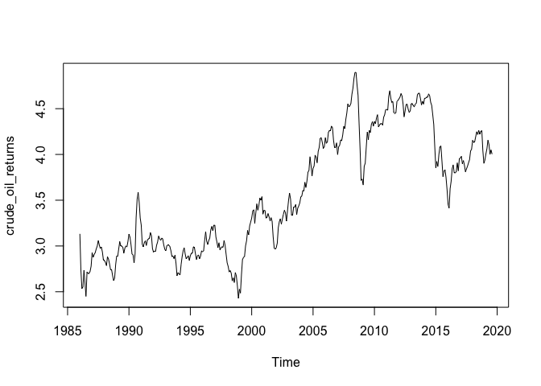

``` r
plot(diff(crude_oil_returns), type = "l")
```

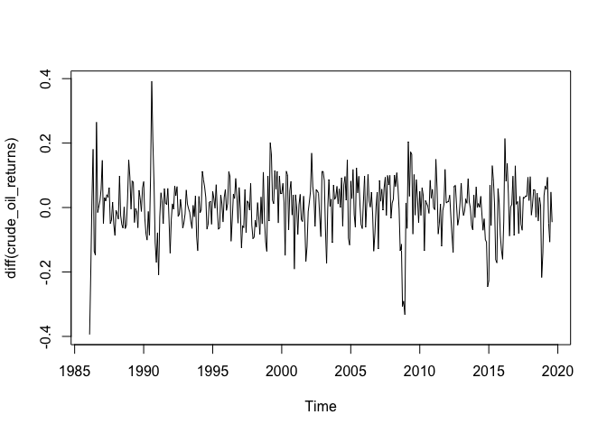

This is looking pretty stabilized. So this suggests that an integrated model is appropriate (d = 1). So let's check the ACF and PACF of the logged data to see if we can determine if an Auto-regressive model, Moving Average model or a combined model is best.

``` r
acf2(crude_oil_returns)
```

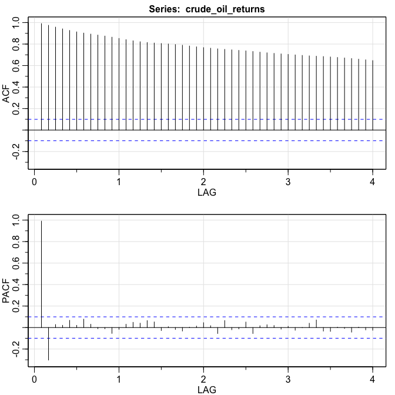

The above suggests a ARIMA(1,1,0) model because the acf is tailing off and the PACF cuts at lag 1 (suggesting AR = 1). I'll use the sarima package to create the model and to forecast it. sarima has some nice tools for this.

``` r
ar_sim_x <- sarima(crude_oil_returns, p = 1, d = 1, q = 0)
```

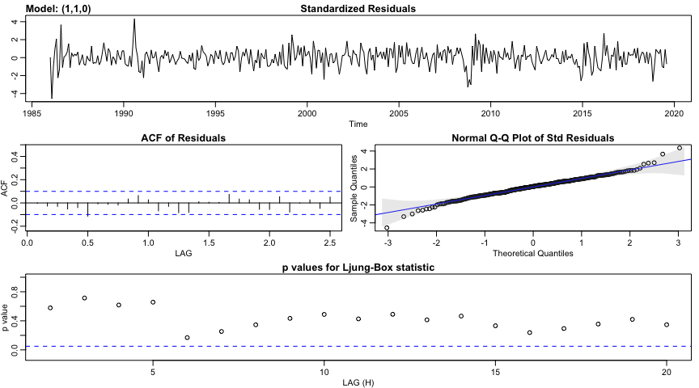

``` r
ar_sim_x
```

    ## $fit
    ## 
    ## Call:
    ## stats::arima(x = xdata, order = c(p, d, q), seasonal = list(order = c(P, D, 
    ##     Q), period = S), xreg = constant, transform.pars = trans, fixed = fixed, 
    ##     optim.control = list(trace = trc, REPORT = 1, reltol = tol))
    ## 
    ## Coefficients:
    ##          ar1  constant
    ##       0.2834    0.0017
    ## s.e.  0.0491    0.0058
    ## 
    ## sigma^2 estimated as 0.006958:  log likelihood = 429.16,  aic = -852.32
    ## 
    ## $degrees_of_freedom
    ## [1] 401
    ## 
    ## $ttable
    ##          Estimate     SE t.value p.value
    ## ar1        0.2834 0.0491  5.7729  0.0000
    ## constant   0.0017 0.0058  0.2958  0.7676
    ## 
    ## $AIC
    ## [1] -2.114934
    ## 
    ## $AICc
    ## [1] -2.11486
    ## 
    ## $BIC
    ## [1] -2.085165

So we see from above that the AR1 parameter is significant as the p.value is zero. Also, we note to AIC and BIC for comparison with subsequent models. We want these to be as small as possible.

Let's try adding a parameter and see if that improves things? We are looking for the Akaike Information Criterion (AIC) and the Bayesian Information Criterion (BIC) to judge the strength of the model.

``` r
ar_sim_x_2 <- sarima(crude_oil_returns, p = 2, d = 1, q = 0)
```

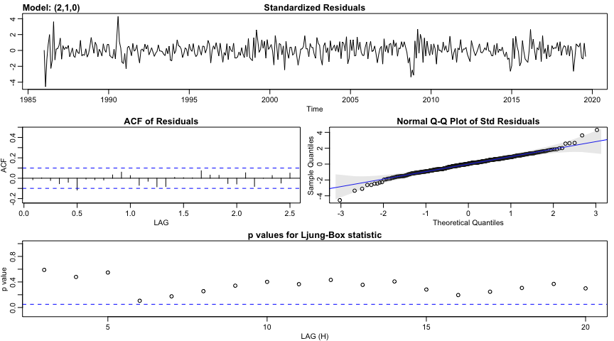

``` r
ar_sim_x_2
```

    ## $fit
    ## 
    ## Call:
    ## stats::arima(x = xdata, order = c(p, d, q), seasonal = list(order = c(P, D, 
    ##     Q), period = S), xreg = constant, transform.pars = trans, fixed = fixed, 
    ##     optim.control = list(trace = trc, REPORT = 1, reltol = tol))
    ## 
    ## Coefficients:
    ##          ar1      ar2  constant
    ##       0.2927  -0.0359    0.0018
    ## s.e.  0.0508   0.0511    0.0056
    ## 
    ## sigma^2 estimated as 0.006949:  log likelihood = 429.41,  aic = -850.81
    ## 
    ## $degrees_of_freedom
    ## [1] 400
    ## 
    ## $ttable
    ##          Estimate     SE t.value p.value
    ## ar1        0.2927 0.0508  5.7616  0.0000
    ## ar2       -0.0359 0.0511 -0.7014  0.4835
    ## constant   0.0018 0.0056  0.3222  0.7474
    ## 
    ## $AIC
    ## [1] -2.111192
    ## 
    ## $AICc
    ## [1] -2.111043
    ## 
    ## $BIC
    ## [1] -2.0715

That does not. We can see that the added parameter is not statistically significant and the BIC and AIC both go up. After a few more less probable attempts we can be certain that the first model is looking best.

Now let's see if adding seasonality to the model will improve it. Looking at the ACF/PCF for the differenced data.

``` r
acf2(diff(diff(crude_oil_returns), 48))
```


From the ACF/PACF it seems that the ACF may trail off at each log (12 months) and the PCF cuts off. But the signal is small if any. We can try to add a seasonal AR and see what happens.

``` r
ar_sim_x_3 <- sarima(crude_oil_returns, p = 1, d = 1, q = 0, P = 1, D = 0, Q = 0, S = 12)
```

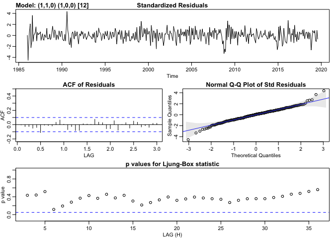

``` r
ar_sim_x_3
```

    ## $fit
    ## 
    ## Call:
    ## stats::arima(x = xdata, order = c(p, d, q), seasonal = list(order = c(P, D, 
    ##     Q), period = S), xreg = constant, transform.pars = trans, fixed = fixed, 
    ##     optim.control = list(trace = trc, REPORT = 1, reltol = tol))
    ## 
    ## Coefficients:
    ##          ar1    sar1  constant
    ##       0.2832  0.0241    0.0017
    ## s.e.  0.0491  0.0535    0.0059
    ## 
    ## sigma^2 estimated as 0.006954:  log likelihood = 429.26,  aic = -850.52
    ## 
    ## $degrees_of_freedom
    ## [1] 400
    ## 
    ## $ttable
    ##          Estimate     SE t.value p.value
    ## ar1        0.2832 0.0491  5.7699  0.0000
    ## sar1       0.0241 0.0535  0.4494  0.6534
    ## constant   0.0017 0.0059  0.2851  0.7757
    ## 
    ## $AIC
    ## [1] -2.110472
    ## 
    ## $AICc
    ## [1] -2.110323
    ## 
    ## $BIC
    ## [1] -2.070781

This model is not better. The seasonal AR is not significant and the AIC and BIC have increased. Seems adding a seasonal component doesn't improve the model.

Now that we are satisfied with the non-seasonal ARIMA(1,1,0), let's forecast 6 months ahead. We'll use the sarima package

``` r
oil_for <- sarima.for(cop, n.ahead = 6, 1,1,0)
```

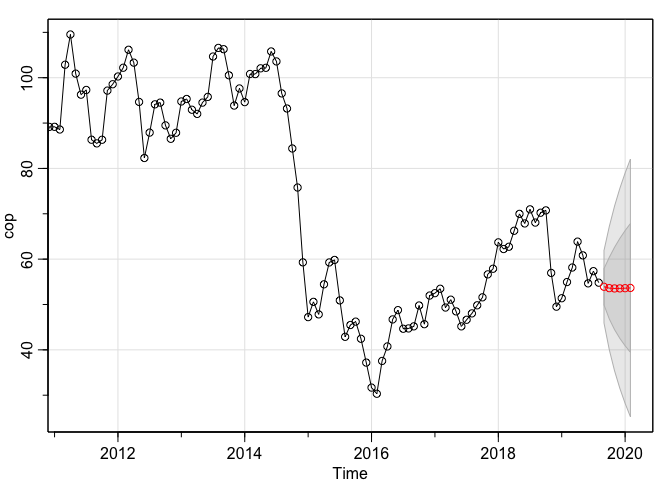

``` r
oil_for$pred
```

    ##           Jan      Feb Mar Apr May Jun Jul Aug      Sep      Oct      Nov
    ## 2019                                           53.90442 53.60729 53.53667
    ## 2020 53.59547 53.65225                                                   
    ##           Dec
    ## 2019 53.55037
    ## 2020

Gas Prices
==========

``` r
gas_price <- ts(energy_df$`New York Harbor Conventional Gasoline Regular Spot Price FOB (Dollars per Gallon)`, start= c(1986,1), end = c(2019,8), frequency = 12)
```

``` r
plot(diff(gas_price), type = "l")
```

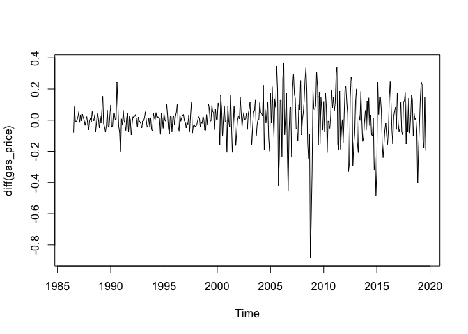

``` r
gas_returns <- log(gas_price)
plot(gas_returns, type = "l")
```

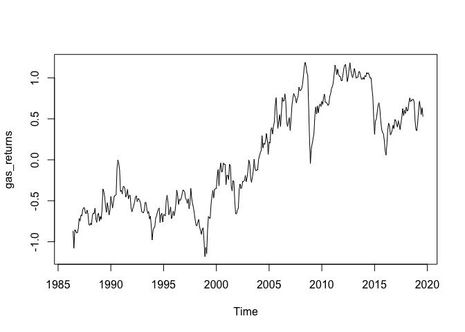

``` r
plot(diff(gas_returns), type = "l")
```


``` r
acf2(gas_returns)
```

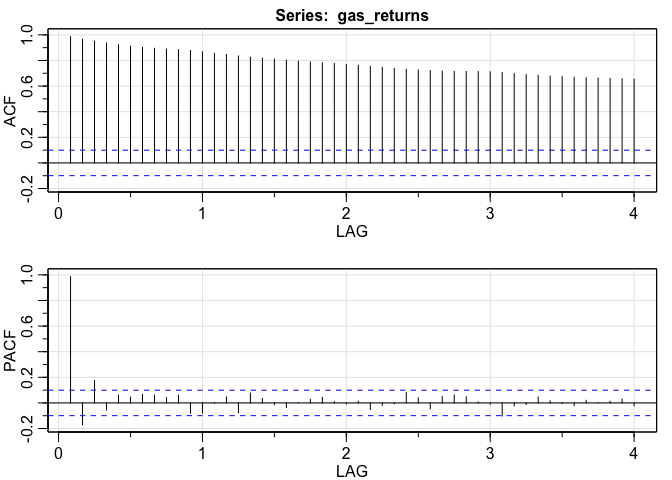

``` r
gas_mdl <- sarima(gas_returns, p = 2, d = 1, q = 0)
```

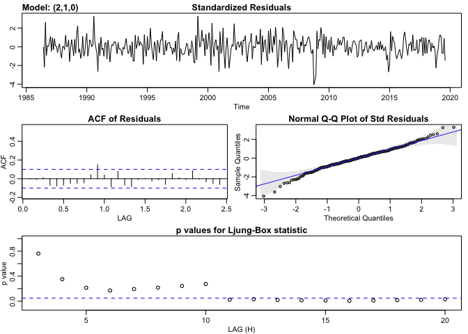

``` r
gas_mdl
```

``` r
gas_mdl <- sarima(gas_returns, p = 1, d = 1, q = 2)
```


``` r
gas_mdl
```

``` r
sarima.for(gas_price, 1,1,2, n.ahead = 6)
```

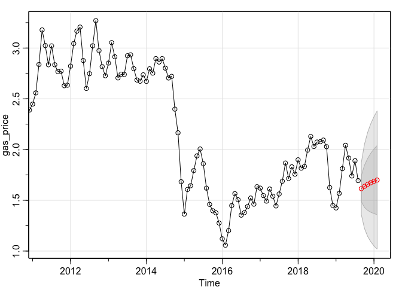

    ## $pred
    ##           Jan      Feb Mar Apr May Jun Jul Aug      Sep      Oct      Nov
    ## 2019                                           1.614915 1.637612 1.656848
    ## 2020 1.687288 1.699412                                                   
    ##           Dec
    ## 2019 1.673238
    ## 2020         
    ## 
    ## $se
    ##            Jan       Feb Mar Apr May Jun Jul Aug       Sep       Oct
    ## 2019                                             0.1279105 0.2074903
    ## 2020 0.3180102 0.3403182                                            
    ##            Nov       Dec
    ## 2019 0.2557773 0.2907294
    ## 2020
