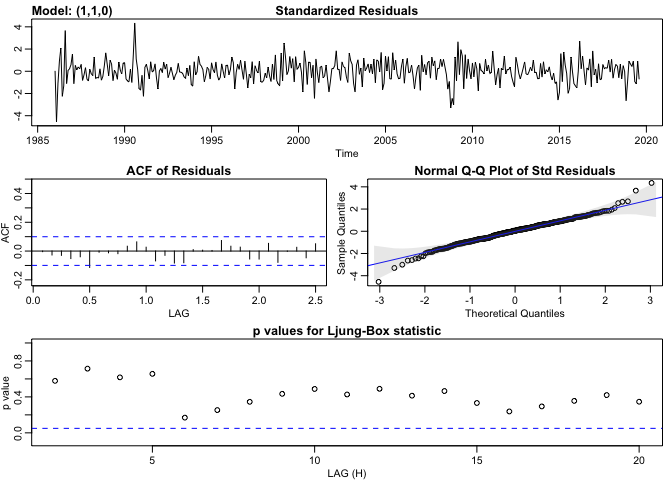
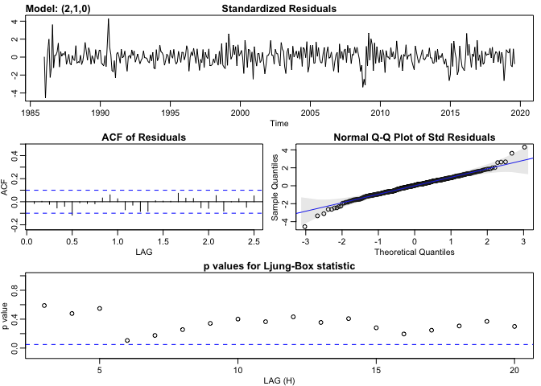

Crude Oil Modeling
================
Kevin Bonds
11/24/2019

The following is an exercise in forcasting crude oil products. All code for this analysis can be found at: <https://github.com/kwbonds/crudeoil_products>. Feel free to clone/fork.

The first thing to do is to load the libraries needed

``` r
library(tidyverse)
library(readxl)
library(lubridate)
library(zoo)
library(knitr)
library(ggplot2)
library(yardstick)
library(Metrics)
library(astsa)
```

Collecting data
===============

The xls file can be downloaded from: <https://www.eia.gov/dnav/pet/PET_PRI_SPT_S1_M.htm>.

We'll load the data and do some quick formatting. Then we'll take a quick look and begin modeling the data and make predictions. Loading the individual Excel tabs in to tables and joining them into one big table.

``` r
# Read rest of data directly from xlsx file into tables
raw_data_path <- "../DATA/raw_data_sheet.xlsx"
sheets <- raw_data_path %>%
        excel_sheets() %>% 
        set_names()

crude_oil <- read_excel(raw_data_path, sheet = sheets[2], skip = 2, col_types = c("date", "numeric", "numeric")) %>% 
        mutate("Date2" = as.Date(as.yearmon(Date, "%b-%Y"), frac = 1),
               "Month" = month(Date2),
               "Year" = year(Date2))

conv_gasoline <- read_excel(raw_data_path, sheet = sheets[3], skip = 2, col_types = c("date", "numeric", "numeric")) %>% 
        mutate("Month" = month(Date), "Year" = year(Date))

RBOB_gasoline <- read_excel(raw_data_path, sheet = sheets[4], skip = 2, col_types = c("date", "numeric")) %>% 
        mutate("Month" = month(Date), "Year" = year(Date))

heating_oil <- read_excel(raw_data_path, sheet = sheets[5], skip = 2, col_types = c("date", "numeric")) %>% 
        mutate("Month" = month(Date), "Year" = year(Date))

uls_diesel <- read_excel(raw_data_path, sheet = sheets[6], skip = 2, col_types = c("date", "numeric", "numeric", "numeric")) %>% 
        mutate("Month" = month(Date), "Year" = year(Date))

jet <- read_excel(raw_data_path, sheet = sheets[7], skip = 2, col_types = c("date", "numeric")) %>% 
        mutate("Month" = month(Date), "Year" = year(Date))
propane <- read_excel(raw_data_path, sheet = sheets[8], skip = 2, col_types = c("date", "numeric")) %>% 
        mutate("Month" = month(Date), "Year" = year(Date))
```

Since prices are taken at the end of the month, dates are converted to month end.

``` r
# Join conv_gasoline and heating_oil
energy_df <- 
        left_join(crude_oil, conv_gasoline[,2:5], on = c("Year" = "Year", "Month" = "Month")) %>% 
        left_join(heating_oil[,2:4], on = c("Year" = "Year", "Month" = "Month")) %>%
        left_join(uls_diesel[-1], on = c("Year" = "Year", "Month" = "Month")) %>% 
        left_join(RBOB_gasoline[-1], on = c("Year" = "Year", "Month" = "Month")) %>% 
        left_join(jet[-1], on = c("Year" = "Year", "Month" = "Month")) %>% 
        left_join(propane[-1], on = c("Year" = "Year", "Month" = "Month"))

energy_df <- energy_df %>% select("Date"= `Date2`, c(5:6, 2:3, 7:length(energy_df)))
kable(head(energy_df))
```

| Date       |  Month|  Year|  Cushing, OK WTI Spot Price FOB (Dollars per Barrel)|  Europe Brent Spot Price FOB (Dollars per Barrel)|  New York Harbor Conventional Gasoline Regular Spot Price FOB (Dollars per Gallon)|  U.S. Gulf Coast Conventional Gasoline Regular Spot Price FOB (Dollars per Gallon)|  New York Harbor No. 2 Heating Oil Spot Price FOB (Dollars per Gallon)|  New York Harbor Ultra-Low Sulfur No 2 Diesel Spot Price (Dollars per Gallon)|  U.S. Gulf Coast Ultra-Low Sulfur No 2 Diesel Spot Price (Dollars per Gallon)|  Los Angeles, CA Ultra-Low Sulfur CARB Diesel Spot Price (Dollars per Gallon)|  Los Angeles Reformulated RBOB Regular Gasoline Spot Price (Dollars per Gallon)|  U.S. Gulf Coast Kerosene-Type Jet Fuel Spot Price FOB (Dollars per Gallon)|  Mont Belvieu, TX Propane Spot Price FOB (Dollars per Gallon)|
|:-----------|------:|-----:|----------------------------------------------------:|-------------------------------------------------:|----------------------------------------------------------------------------------:|----------------------------------------------------------------------------------:|----------------------------------------------------------------------:|-----------------------------------------------------------------------------:|-----------------------------------------------------------------------------:|-----------------------------------------------------------------------------:|-------------------------------------------------------------------------------:|---------------------------------------------------------------------------:|-------------------------------------------------------------:|
| 1986-01-31 |      1|  1986|                                                22.93|                                                NA|                                                                                 NA|                                                                                 NA|                                                                     NA|                                                                            NA|                                                                            NA|                                                                            NA|                                                                              NA|                                                                          NA|                                                            NA|
| 1986-02-28 |      2|  1986|                                                15.46|                                                NA|                                                                                 NA|                                                                                 NA|                                                                     NA|                                                                            NA|                                                                            NA|                                                                            NA|                                                                              NA|                                                                          NA|                                                            NA|
| 1986-03-31 |      3|  1986|                                                12.61|                                                NA|                                                                                 NA|                                                                                 NA|                                                                     NA|                                                                            NA|                                                                            NA|                                                                            NA|                                                                              NA|                                                                          NA|                                                            NA|
| 1986-04-30 |      4|  1986|                                                12.84|                                                NA|                                                                                 NA|                                                                                 NA|                                                                     NA|                                                                            NA|                                                                            NA|                                                                            NA|                                                                              NA|                                                                          NA|                                                            NA|
| 1986-05-31 |      5|  1986|                                                15.38|                                                NA|                                                                                 NA|                                                                                 NA|                                                                     NA|                                                                            NA|                                                                            NA|                                                                            NA|                                                                              NA|                                                                          NA|                                                            NA|
| 1986-06-30 |      6|  1986|                                                13.43|                                                NA|                                                                               0.42|                                                                              0.409|                                                                   0.38|                                                                            NA|                                                                            NA|                                                                            NA|                                                                              NA|                                                                          NA|                                                            NA|

Modeling crude oil
==================

To create a time series model for crude oil price we should determine what sort of model may best fit. Looking again at the plot of the data:

``` r
ggplot(energy_df, aes(x = energy_df$Date, y = energy_df$`Cushing, OK WTI Spot Price FOB (Dollars per Barrel)`)) + geom_line() + ylab("WTI Spot Price (Dollars per Barrel)") + xlab("Date") + ggtitle("Monthly average for West Texas Crude Oil")
```


It appears the data is not standardized. There is a general trend and maybe some exponential growth. Let's try standardizing the data by log-diffenecing to remove trend and growth.

``` r
cop <-  ts(energy_df$`Cushing, OK WTI Spot Price FOB (Dollars per Barrel)`, start= c(1986,1), end = c(2019,8), frequency = 12)
```

``` r
crude_oil_returns <- log(cop)
plot(crude_oil_returns, type = "l")
```


``` r
plot(diff(crude_oil_returns), type = "l")
```


This is looking pretty stablized. So this suggests that an integrated model is appropriate (d = 1). So let's check the ACF and PACF and see if we can determine if an Auto-regressive model, Moving Average model or a combined model is best.

``` r
acf2(crude_oil_returns)
```


    ##        ACF  PACF
    ##  [1,] 0.99  0.99
    ##  [2,] 0.97 -0.30
    ##  [3,] 0.96  0.03
    ##  [4,] 0.94  0.02
    ##  [5,] 0.93  0.07
    ##  [6,] 0.91  0.02
    ##  [7,] 0.90  0.08
    ##  [8,] 0.89  0.03
    ##  [9,] 0.88 -0.01
    ## [10,] 0.87 -0.01
    ## [11,] 0.86 -0.05
    ## [12,] 0.85 -0.02
    ## [13,] 0.84  0.03
    ## [14,] 0.83  0.05
    ## [15,] 0.82  0.04
    ## [16,] 0.81  0.06
    ## [17,] 0.81  0.05
    ## [18,] 0.81 -0.03
    ## [19,] 0.80  0.01
    ## [20,] 0.80 -0.02
    ## [21,] 0.79 -0.03
    ## [22,] 0.78  0.00
    ## [23,] 0.77  0.01
    ## [24,] 0.77  0.05
    ## [25,] 0.76  0.02
    ## [26,] 0.76 -0.06
    ## [27,] 0.75  0.06
    ## [28,] 0.75 -0.02
    ## [29,] 0.74 -0.01
    ## [30,] 0.74  0.05
    ## [31,] 0.73 -0.06
    ## [32,] 0.72  0.02
    ## [33,] 0.72  0.03
    ## [34,] 0.71  0.02
    ## [35,] 0.71 -0.01
    ## [36,] 0.70  0.01
    ## [37,] 0.70 -0.02
    ## [38,] 0.69  0.00
    ## [39,] 0.69  0.04
    ## [40,] 0.69  0.07
    ## [41,] 0.68 -0.03
    ## [42,] 0.68 -0.04
    ## [43,] 0.68  0.00
    ## [44,] 0.67 -0.01
    ## [45,] 0.67 -0.04
    ## [46,] 0.66  0.00
    ## [47,] 0.65 -0.02
    ## [48,] 0.65 -0.03

The above suggests a ARIMA(1,1,0) model because the acf is tailing off and the PACF cuts at lag 1 (suggesting ar = 1).

``` r
ar_sim_x <- sarima(crude_oil_returns, p = 1, d = 1, q = 0)
```

    ## initial  value -2.469471 
    ## iter   2 value -2.509170
    ## iter   3 value -2.509302
    ## iter   4 value -2.509311
    ## iter   5 value -2.509335
    ## iter   5 value -2.509335
    ## iter   5 value -2.509335
    ## final  value -2.509335 
    ## converged
    ## initial  value -2.483636 
    ## iter   2 value -2.483766
    ## iter   3 value -2.483795
    ## iter   4 value -2.483832
    ## iter   5 value -2.483847
    ## iter   6 value -2.483850
    ## iter   7 value -2.483850
    ## iter   7 value -2.483850
    ## iter   7 value -2.483850
    ## final  value -2.483850 
    ## converged


``` r
ar_sim_x
```

    ## $fit
    ## 
    ## Call:
    ## stats::arima(x = xdata, order = c(p, d, q), seasonal = list(order = c(P, D, 
    ##     Q), period = S), xreg = constant, transform.pars = trans, fixed = fixed, 
    ##     optim.control = list(trace = trc, REPORT = 1, reltol = tol))
    ## 
    ## Coefficients:
    ##          ar1  constant
    ##       0.2834    0.0017
    ## s.e.  0.0491    0.0058
    ## 
    ## sigma^2 estimated as 0.006958:  log likelihood = 429.16,  aic = -852.32
    ## 
    ## $degrees_of_freedom
    ## [1] 401
    ## 
    ## $ttable
    ##          Estimate     SE t.value p.value
    ## ar1        0.2834 0.0491  5.7729  0.0000
    ## constant   0.0017 0.0058  0.2958  0.7676
    ## 
    ## $AIC
    ## [1] -2.114934
    ## 
    ## $AICc
    ## [1] -2.11486
    ## 
    ## $BIC
    ## [1] -2.085165

Let's try adding a parameter and see if that improves things?

``` r
ar_sim_x <- sarima(crude_oil_returns, p = 2, d = 1, q = 0)
```

    ## initial  value -2.475645 
    ## iter   2 value -2.507592
    ## iter   3 value -2.510651
    ## iter   4 value -2.510669
    ## iter   5 value -2.510687
    ## iter   6 value -2.510696
    ## iter   7 value -2.510698
    ## iter   8 value -2.510698
    ## iter   8 value -2.510698
    ## final  value -2.510698 
    ## converged
    ## initial  value -2.483934 
    ## iter   2 value -2.484353
    ## iter   3 value -2.484386
    ## iter   4 value -2.484450
    ## iter   5 value -2.484459
    ## iter   6 value -2.484460
    ## iter   6 value -2.484460
    ## iter   6 value -2.484460
    ## final  value -2.484460 
    ## converged



``` r
ar_sim_x
```

    ## $fit
    ## 
    ## Call:
    ## stats::arima(x = xdata, order = c(p, d, q), seasonal = list(order = c(P, D, 
    ##     Q), period = S), xreg = constant, transform.pars = trans, fixed = fixed, 
    ##     optim.control = list(trace = trc, REPORT = 1, reltol = tol))
    ## 
    ## Coefficients:
    ##          ar1      ar2  constant
    ##       0.2927  -0.0359    0.0018
    ## s.e.  0.0508   0.0511    0.0056
    ## 
    ## sigma^2 estimated as 0.006949:  log likelihood = 429.41,  aic = -850.81
    ## 
    ## $degrees_of_freedom
    ## [1] 400
    ## 
    ## $ttable
    ##          Estimate     SE t.value p.value
    ## ar1        0.2927 0.0508  5.7616  0.0000
    ## ar2       -0.0359 0.0511 -0.7014  0.4835
    ## constant   0.0018 0.0056  0.3222  0.7474
    ## 
    ## $AIC
    ## [1] -2.111192
    ## 
    ## $AICc
    ## [1] -2.111043
    ## 
    ## $BIC
    ## [1] -2.0715

That does not. We can see that the added parameter is not statistically significant and the BIC and AIC both go down.

Now that we are satisfied with out quick model, let's forecast 6 months ahead.

``` r
oil_for <- sarima.for(cop, n.ahead = 6, 1,1,0)
```



``` r
oil_for$pred
```

    ##           Jan      Feb Mar Apr May Jun Jul Aug      Sep      Oct      Nov
    ## 2019                                           53.90442 53.60729 53.53667
    ## 2020 53.59547 53.65225                                                   
    ##           Dec
    ## 2019 53.55037
    ## 2020

Gas Prices
==========

``` r
gas_price <- ts(energy_df$`New York Harbor Conventional Gasoline Regular Spot Price FOB (Dollars per Gallon)`, start= c(1986,1), end = c(2019,8), frequency = 12)
```

``` r
plot(diff(gas_price), type = "l")
```


``` r
gas_returns <- log(gas_price)
plot(gas_returns, type = "l")
```


``` r
plot(diff(gas_returns), type = "l")
```


``` r
acf2(gas_returns)
```


    ##        ACF  PACF
    ##  [1,] 0.99  0.99
    ##  [2,] 0.97 -0.17
    ##  [3,] 0.95  0.17
    ##  [4,] 0.94 -0.06
    ##  [5,] 0.92  0.06
    ##  [6,] 0.91  0.05
    ##  [7,] 0.90  0.07
    ##  [8,] 0.90  0.06
    ##  [9,] 0.89  0.04
    ## [10,] 0.88  0.06
    ## [11,] 0.88 -0.08
    ## [12,] 0.87 -0.08
    ## [13,] 0.86  0.00
    ## [14,] 0.85  0.05
    ## [15,] 0.84 -0.08
    ## [16,] 0.83  0.08
    ## [17,] 0.82  0.03
    ## [18,] 0.81 -0.01
    ## [19,] 0.80 -0.04
    ## [20,] 0.79  0.00
    ## [21,] 0.79  0.03
    ## [22,] 0.78  0.04
    ## [23,] 0.78  0.01
    ## [24,] 0.77 -0.01
    ## [25,] 0.76  0.01
    ## [26,] 0.75 -0.05
    ## [27,] 0.75 -0.02
    ## [28,] 0.74 -0.01
    ## [29,] 0.73  0.08
    ## [30,] 0.73  0.04
    ## [31,] 0.72 -0.05
    ## [32,] 0.72  0.05
    ## [33,] 0.71  0.06
    ## [34,] 0.71  0.05
    ## [35,] 0.71  0.01
    ## [36,] 0.71 -0.01
    ## [37,] 0.71 -0.10
    ## [38,] 0.70 -0.02
    ## [39,] 0.69 -0.01
    ## [40,] 0.68  0.05
    ## [41,] 0.68  0.02
    ## [42,] 0.67 -0.01
    ## [43,] 0.67 -0.02
    ## [44,] 0.67  0.02
    ## [45,] 0.66  0.00
    ## [46,] 0.66  0.01
    ## [47,] 0.66  0.03
    ## [48,] 0.65 -0.02

``` r
gas_mdl <- sarima(gas_returns, p = 2, d = 1, q = 0)
```

    ## initial  value -2.317855 
    ## iter   2 value -2.340476
    ## iter   3 value -2.340951
    ## iter   4 value -2.340968
    ## iter   5 value -2.340969
    ## iter   6 value -2.340969
    ## iter   7 value -2.340969
    ## iter   7 value -2.340969
    ## iter   7 value -2.340969
    ## final  value -2.340969 
    ## converged


``` r
gas_mdl
```

    ## $fit
    ## 
    ## Call:
    ## stats::arima(x = xdata, order = c(p, d, q), seasonal = list(order = c(P, D, 
    ##     Q), period = S), xreg = constant, transform.pars = trans, fixed = fixed, 
    ##     optim.control = list(trace = trc, REPORT = 1, reltol = tol))
    ## 
    ## Coefficients:
    ##          ar1      ar2  constant
    ##       0.1684  -0.1624    0.0034
    ## s.e.  0.0499   0.0502    0.0049
    ## 
    ## sigma^2 estimated as 0.009259:  log likelihood = 366.97,  aic = -725.94
    ## 
    ## $degrees_of_freedom
    ## [1] 395
    ## 
    ## $ttable
    ##          Estimate     SE t.value p.value
    ## ar1        0.1684 0.0499  3.3724  0.0008
    ## ar2       -0.1624 0.0502 -3.2329  0.0013
    ## constant   0.0034 0.0049  0.6952  0.4873
    ## 
    ## $AIC
    ## [1] -1.801331
    ## 
    ## $AICc
    ## [1] -1.801181
    ## 
    ## $BIC
    ## [1] -1.761763

``` r
gas_mdl <- sarima(gas_returns, p = 1, d = 1, q = 2)
```

    ## initial  value -2.317855 
    ## iter   2 value -2.336138
    ## iter   3 value -2.342417
    ## iter   4 value -2.342493
    ## iter   5 value -2.342513
    ## iter   6 value -2.344440
    ## iter   7 value -2.344704
    ## iter   8 value -2.344872
    ## iter   9 value -2.344999
    ## iter  10 value -2.345298
    ## iter  11 value -2.345575
    ## iter  12 value -2.345831
    ## iter  13 value -2.346279
    ## iter  14 value -2.346625
    ## iter  15 value -2.347228
    ## iter  16 value -2.347895
    ## iter  17 value -2.347970
    ## iter  18 value -2.347983
    ## iter  19 value -2.347985
    ## iter  20 value -2.347996
    ## iter  21 value -2.348006
    ## iter  22 value -2.348017
    ## iter  23 value -2.348022
    ## iter  24 value -2.348022
    ## iter  24 value -2.348022
    ## final  value -2.348022 
    ## converged


``` r
gas_mdl
```

    ## $fit
    ## 
    ## Call:
    ## stats::arima(x = xdata, order = c(p, d, q), seasonal = list(order = c(P, D, 
    ##     Q), period = S), xreg = constant, transform.pars = trans, fixed = fixed, 
    ##     optim.control = list(trace = trc, REPORT = 1, reltol = tol))
    ## 
    ## Coefficients:
    ##          ar1      ma1      ma2  constant
    ##       0.7096  -0.5427  -0.2655    0.0034
    ## s.e.  0.1574   0.1596   0.0532    0.0032
    ## 
    ## sigma^2 estimated as 0.009127:  log likelihood = 369.78,  aic = -729.55
    ## 
    ## $degrees_of_freedom
    ## [1] 394
    ## 
    ## $ttable
    ##          Estimate     SE t.value p.value
    ## ar1        0.7096 0.1574  4.5086  0.0000
    ## ma1       -0.5427 0.1596 -3.3996  0.0007
    ## ma2       -0.2655 0.0532 -4.9886  0.0000
    ## constant   0.0034 0.0032  1.0770  0.2821
    ## 
    ## $AIC
    ## [1] -1.810299
    ## 
    ## $AICc
    ## [1] -1.810049
    ## 
    ## $BIC
    ## [1] -1.760839

``` r
sarima.for(gas_price, 1,1,2, n.ahead = 6)
```


    ## $pred
    ##           Jan      Feb Mar Apr May Jun Jul Aug      Sep      Oct      Nov
    ## 2019                                           1.614915 1.637612 1.656848
    ## 2020 1.687288 1.699412                                                   
    ##           Dec
    ## 2019 1.673238
    ## 2020         
    ## 
    ## $se
    ##            Jan       Feb Mar Apr May Jun Jul Aug       Sep       Oct
    ## 2019                                             0.1279105 0.2074903
    ## 2020 0.3180102 0.3403182                                            
    ##            Nov       Dec
    ## 2019 0.2557773 0.2907294
    ## 2020
